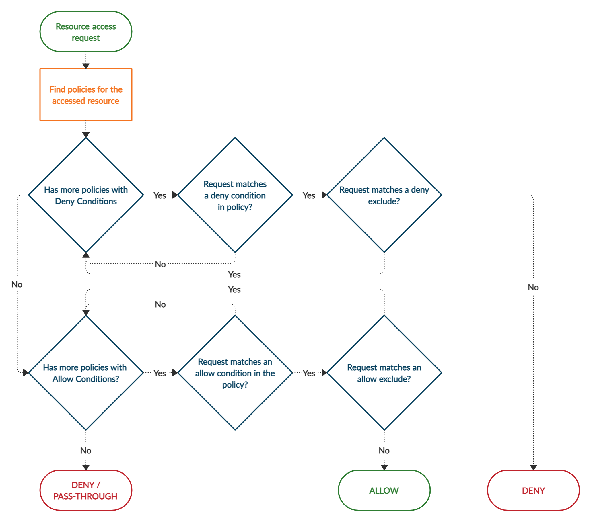
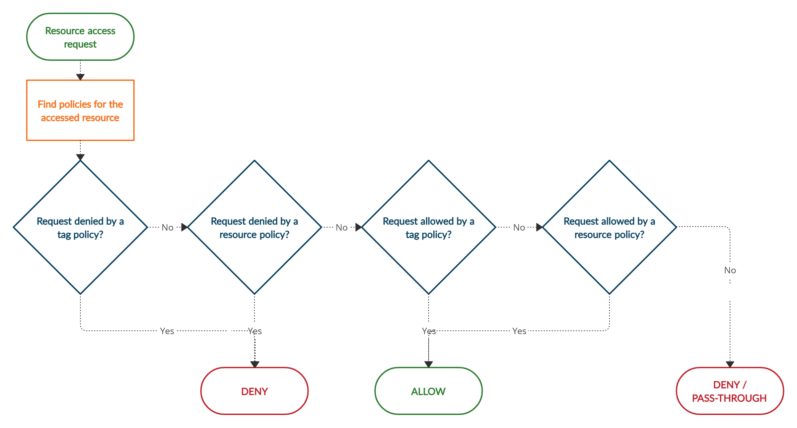

.. _ranger-overview:

======================
Apache Ranger Overview
======================

The Apache Ranger framework, provides a centralized platform which administers and regulates 
security policies across Hadoop components. Apache Ranger also provides a framework for 
collecting access audit history and reporting data.

Hadoop components
=================

Hadoop components supported by Apache Ranger, include, but not limited to the following:

* `Apache Hadoop HDFS <https://hadoop.apache.org/>`_
* `Apache Hive <https://hive.apache.org/>`_
* `Apache HBase <https://hbase.apache.org/>`_
* `Apache Storm <https://storm.apache.org/>`_
* `Apache Knox <https://knox.apache.org/>`_
* `Apache Solr <https://solr.apache.org/>`_
* `Apache Kafka <https://kafka.apache.org/>`_
* `Apache NiFi <https://nifi.apache.org/>`_
* `Apache Atlas <https://atlas.apache.org/>`_
* `Apache Sqoop <https://sqoop.apache.org/>`_
* `Apache Spark <https://spark.apache.org/>`_
* `Apache Kudu <https://kudu.apache.org/>`_
* `Apache Kylin <http://kylin.apache.org/>`_
* `Apache Hadoop Ozone <https://hadoop.apache.org/ozone>`_
* `Apache Hadoop Yarn <https://hadoop.apache.org/docs/current/hadoop-yarn/hadoop-yarn-site/YARN.html>`_

Policies overview
=================

Apache Ranger supports 2 types of policies:

1. resource-based
2. tag-based

.. warning::

    The RangerCLI currently does not support tag-based policies.

Resource-based policies
***********************

Resource-based policies allows users to configure access policies on Hadoop services.

Tag-based policies
******************

Tag-based policies allows users to configure access policies across mutliple Hadoop components without creating
separate services and policies in each component.

Row-filter and masking policies in Hive
=======================================

Apache Ranger supports row-level filters and column masking to set access policies for rows in Hive tables.

Row-level filtering in Hive
***************************

Row-level filtering helps simplify authoring of the Hive query, and provides seamless behind-the-scenes 
enforcement of row-level segmentation without having to add this logic to the predicate of the query.

Data masking in Hive
********************

Resource-based column masking
-----------------------------

Column masking capabilities protect sensitive data in Hive in near real-time. You can set policies that mask or 
anonymize sensitive data columns from Hive query output.

Tag-based column masking
------------------------

Tag-based masking policy anonymizes Hive column data based on tags and tag attribute values associated with
Hive column.

`Apache Ranger <https://ranger.apache.org/>`_